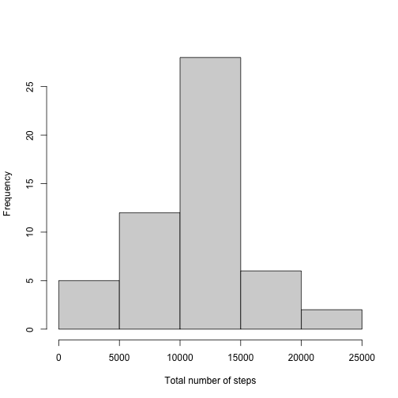
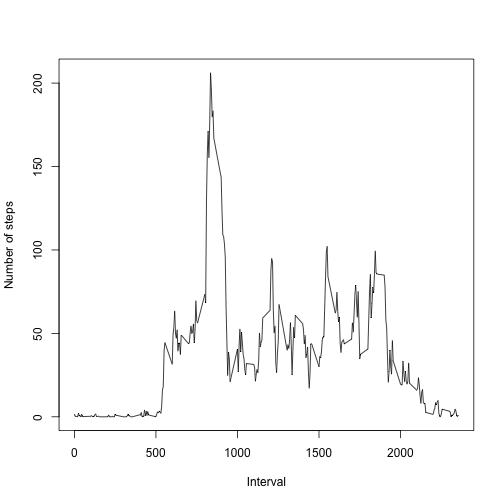
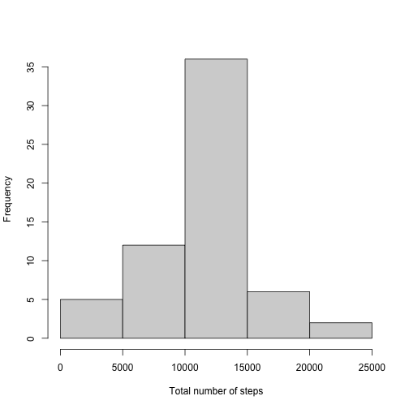
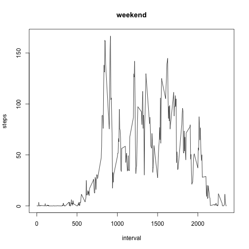

```r
library(knitr)
library(ggplot2)
library(lattice)
library(dplyr)
library(plyr)
library(stringi)
```


## 1. Code for reading in the dataset and/or processing the data


```r
activity <- read.csv("activity.csv")
activity0 <- na.omit(activity) ## dataset without NA
activity0$date <- as.Date(as.character(activity0$date, "%Y%m%d")) ## convert activity's date in DATE class
sum0 <- tapply(activity0$steps, activity0$date, sum) ## get the total steps (ARRAY class) in each day
sum0df <- data.frame(Total.steps = sum0, date = names(sum0)) ## convert sum0 into data frame by column names of sum0 and observation as sum0 total steps value
```


## 2. Histogram of the total number of steps taken each day




## 3. Mean and median number of steps taken each day


```r
summary(sum0df$Total.steps)
```

```
##    Min. 1st Qu.  Median    Mean 3rd Qu.    Max. 
##      41    8841   10765   10766   13294   21194
```
#### The mean of steps taken each day is 10,766 / The median of steps taken each day is 10,765.


## 4. Time series plot of the average number of steps taken




```r
max.avg.steps <- avg.step[ which.max(avg.step$steps),]
max.avg.steps
```

```
##     interval    steps
## 104      835 206.1698
```
#### The interval 835 contains maximum average number of steps. 


## 5. Imputing missing values


```r
sum(is.na(activity)) 
```

```
## [1] 2304
```
#### The total number of missing values (NA) in the dataset is 2304 rows.


```r
new.activity <- activity

for (i in 1:nrow(new.activity)) { ## range : row 1 to rows of dataset 
        if (is.na(new.activity$steps[i])) { ## condition : if the observation of step is NA , then... 
                value <- new.activity$interval[i] ## save new activity's interval value 
                steps_value <- avg.step[avg.step$interval == value, ] ## extract data frame of interval and steps by the interval value of both data set are equal  
                new.activity$steps[i] <- steps_value$steps ## assign step_value's steps to new activity 
        }
} 
```
#### New dataset with the missing value (NA) filled in 

```r
nrow(activity) == nrow(new.activity)
```

```
## [1] TRUE
```

```r
dim(new.activity)
```

```
## [1] 17568     3
```

```r
head(new.activity)
```

```
##       steps       date interval
## 1 1.7169811 2012-10-01        0
## 2 0.3396226 2012-10-01        5
## 3 0.1320755 2012-10-01       10
## 4 0.1509434 2012-10-01       15
## 5 0.0754717 2012-10-01       20
## 6 2.0943396 2012-10-01       25
```


```r
new.activity$date <- as.Date(as.character(new.activity$date, "%Yd%%m"))
sum1 <- tapply(new.activity$steps, new.activity$date, sum)
sum1df <- data.frame(total.steps = sum1, date = names(sum1))
```




```r
summary1 # Activity dataset without NA.
```

```
##    Min. 1st Qu.  Median    Mean 3rd Qu.    Max. 
##      41    9819   10766   10766   12811   21194
```

```r
summary2 # Activity dataset with missing value filled in.
```

```
##    Min. 1st Qu.  Median    Mean 3rd Qu.    Max. 
##      41    8841   10765   10766   13294   21194
```
#### It is tiny diff of median bewteen two dataset. The impact of imputing missing data is able to be ignorable.

## 8.Panel plot comparing the average number of steps taken per 5-minute interval across weekdays and weekends


